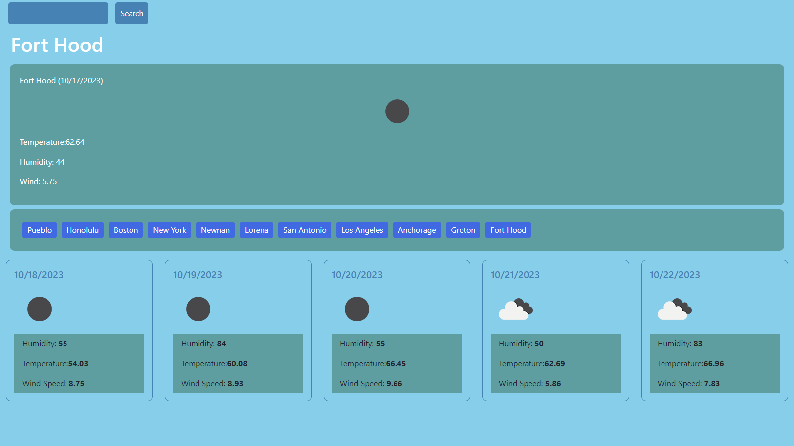

## weather-forecast-dashboard

## User Story
AS A traveler
I WANT to see the weather outlook for multiple cities
SO THAT I can plan a trip accordingly

## Acceptance Criteria
GIVEN a weather dashboard with form inputs
WHEN I search for a city
THEN I am presented with current and future conditions for that city and that city is added to the search history
WHEN I view current weather conditions for that city
THEN I am presented with the city name, the date, an icon representation of weather conditions, the temperature, the humidity, and the wind speed
WHEN I view future weather conditions for that city
THEN I am presented with a 5-day forecast that displays the date, an icon representation of weather conditions, the temperature, the wind speed, and the humidity
WHEN I click on a city in the search history
THEN I am again presented with current and future conditions for that city

## Description
This is a 5 day weather forecast that gives you the current days forecast and the next 5 days forecast for a city that you search. When you search for a city, it creates a button and saves that info to the localStorage so that when you click on that button, it displays the forecast for you again.

## Images

## Links
github repository: https://github.com/allexortiz/weather-forecast-dashboard
website: https://allexortiz.github.io/weather-forecast-dashboard/